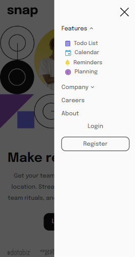

# Frontend Mentor - Snap Intro
This project is my solution of the [Frontend Mentor](https://www.frontendmentor.io) challenge [Intro section with dropdown navigation](https://www.frontendmentor.io/challenges/intro-section-with-dropdown-navigation-ryaPetHE5/hub/intro-section-with-dropdown-navigation-umCuEWRTq-).

Frontend Mentor is a website with challenges that help you improve your coding skills by building realistic projects.
This specific challenge consists basically of a navigation bar with dropdown options and a hero section. The website is fully responsive, with the navbar being collapsible on mobile. It was made using HTML, CSS and vanilla Javascript. 

## [Live URL](https://mateushedp.github.io/snap-intro/)

## Desktop Preview

## Mobile Preview

